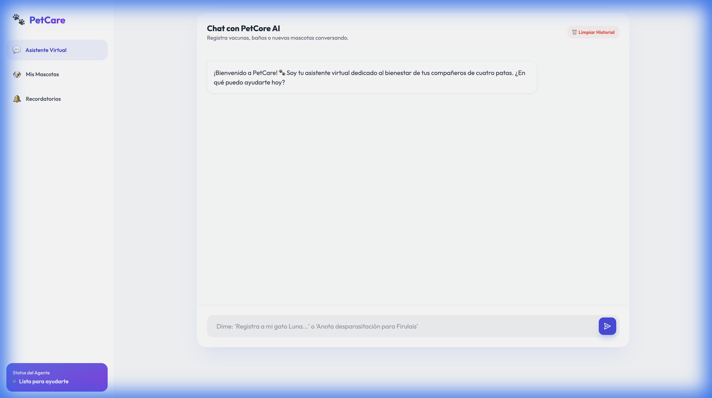
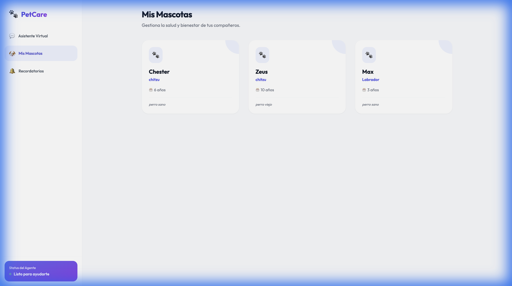
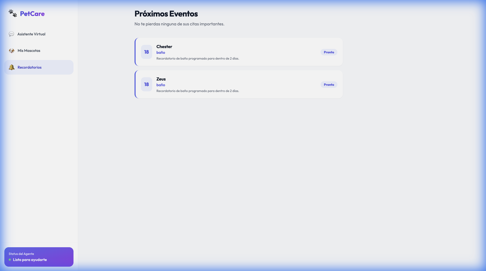

# PetCare Agent - MVP Asistente Virtual para Mascotas 🐾

PetCare Agent es un MVP de asistente conversacional inteligente diseñado para ayudar a los dueños de mascotas a gestionar la salud y el bienestar de sus compañeros. Permite registrar mascotas, perfiles médicos y eventos importantes (vacunas, baños, etc.) a través de una interfaz de chat intuitiva y un dashboard visual.
Es un proyecto simple que integra la API de OpenAI e interactura con servicio de python que permite registrar en BD y presentar datos.

## 🚀 Características

- **Chat Inteligente**: Registra datos de forma natural hablando con la IA.
- **Gestión de Mascotas**: Alta, edición y eliminación (CRUD completo).
- **Dashboard de Recordatorios**: Vista de eventos programados para los próximos 7 días.
- **Historial Persistente**: Conversaciones guardadas localmente en el navegador.
- **Contexto Silencioso**: La IA conoce a tus mascotas pero solo habla de ellas cuando es relevante.

## 📸 Vista Previa

### Asistente Virtual


### Gestión de Mascotas


### Recordatorios Automáticos


## 🛠️ Requisitos previos

- Python 3.10 o superior.
- Una cuenta de OpenAI y una API Key activa.

## ⚙️ Configuración

1. **Clonar o descargar el proyecto** en tu carpeta local.
2. **Crear el archivo de entorno**:
   - Renombra el archivo `.example.env` a `.env`.
   - Abre `.env` y coloca tu API Key de OpenAI:
     ```env
     OPENAI_API_KEY=tu_clave_aqui
     ```
3. **Instalar dependencias**:
   ```bash
   pip install -r requirements.txt
   ```

## 🏃 Cómo ejecutar

Existen varias formas de iniciar el servidor según tu preferencia:

### 1. Comando Estándar (Recomendado)
Usa el lanzador principal en la raíz:
```bash
python main.py
```

### 2. Modo Módulo Python
```bash
python -m src.main
```

### 3. Ejecución Directa con Uvicorn (Desarrollo)
```bash
uvicorn src.main:app --reload
```

El servidor se iniciará en `http://localhost:8000`.

## 📁 Estructura del Proyecto

El proyecto sigue una arquitectura modular para facilitar su escalabilidad:

- **`main.py`**: Lanzador simplificado en la raíz.
- **`src/`**: Núcleo de la aplicación.
  - `main.py`: Configuración de FastAPI, base de datos y archivos estáticos.
  - `api.py`: Definición de rutas (Endpoints) usando `APIRouter`.
  - `schemas.py`: Modelos de validación de datos (Pydantic).
  - `agent.py`: Lógica del agente de IA y herramientas.
  - `database.py`: Modelos de base de datos y conexión (SQLAlchemy).
- **`static/`**: Frontend (HTML, CSS profesional y JS de interacción).
- **`agent-especificaciones.md`**: Guía técnica completa del proyecto.

## 💡 Notas Útiles

- **Base de Datos**: Se utiliza SQLite (`pets.db`). Las tablas se crean automáticamente al arrancar.
- **Validación**: Todas las entradas de la API están validadas con Pydantic V2 para evitar errores de datos.
- **Frontend**: Utiliza Tailwind CSS vía CDN para un diseño premium sin necesidad de herramientas de compilación.
- **Contexto**: El agente utiliza una técnica de "resumen silencioso" de la base de datos para no saturar al usuario con información que ya conoce.

---
> [!IMPORTANT]
> No olvides configurar tu `.env` con una API Key válida de OpenAI para que el asistente pueda responder.
